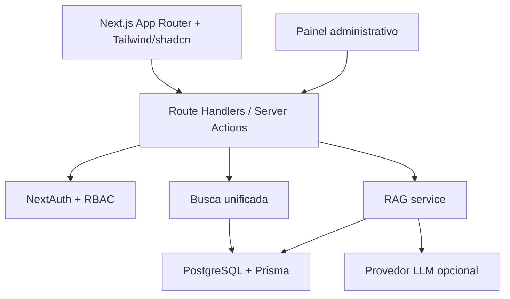

# Arquitetura Completa - Portal do Pesquisador (PQ)

## 1. Contexto

A COCEN coordena 23 Centros e Nucleos de Pesquisa. O portal organiza conteudos que hoje ficam dispersos, padroniza processos administrativos e oferece autoatendimento com busca inteligente e chatbot RAG.

## 2. Principios

- **Centralizacao sem engessar**: conteudos sao classificados por modulo, centro, agencia, perfil e status.
- **Busca primeiro**: o dashboard parte de uma busca global e todos os modulos expõem filtros consistentes.
- **Governanca editorial**: conteudos passam por status, versionamento e auditoria.
- **Autonomia do pesquisador**: respostas curtas, documentos certos e trilhas administrativas claras.
- **Produção pronta**: Docker, env vars, Prisma, NextAuth, RBAC, logs e metricas desde a primeira versao.

## 3. Camadas

## 4. Modulos

| Modulo | Responsabilidade | Entidades principais |
| --- | --- | --- |
| Dashboard | Busca global, metricas, atalhos e alertas | `SearchLog`, `UsageMetric`, `FundingCall` |
| Glossario | Termos administrativos e sinonimos | `GlossaryTerm` |
| Templates | Modelos institucionais versionados | `DocumentTemplate`, `TemplateVersion` |
| Fomento | Editais, agencias, prazos e rubricas | `FundingCall`, `Agency`, `BudgetCategory` |
| Trilhas | Fluxogramas administrativos | `SupportTrail`, `TrailStep` |
| Patentes | Jornada INOVA, prazos e casos | `PatentCase`, `PatentMilestone` |
| FAQ | Perguntas frequentes votadas e classificadas | `FaqItem`, `FaqVote` |
| Chat RAG | Respostas com base documental | `KnowledgeDocument`, `KnowledgeChunk`, `ChatThread` |
| Admin | Conteudo, usuarios, auditoria e metricas | `AuditLog`, `User`, `UsageMetric` |

## 5. Fluxo RAG

1. Administrador cadastra ou importa documento.
2. Documento e quebrado em chunks com metadados.
3. Chunks recebem embeddings e sao salvos em `KnowledgeChunk.embedding`.
4. Pergunta do usuario gera embedding de consulta.
5. Sistema recupera chunks similares via pgvector.
6. Resposta e gerada com contexto, citacoes e trilha de auditoria.

## 6. Controle de Acesso

O controle usa tres camadas:

- `middleware.ts`: faz bloqueio rapido de rotas autenticadas.
- Layouts e paginas server-side: validam sessao e perfis sensiveis.
- `src/lib/permissions.ts`: matriz central para exibicao de menu, acoes e APIs.

## 7. Produção

- Banco PostgreSQL com extensao `vector`.
- Variaveis em `.env`.
- Build standalone do Next.js em Docker.
- Logs administrativos em `AuditLog`.
- Metricas agregadas em `UsageMetric`.
- Seed inicial com termos, editais e templates de exemplo.
